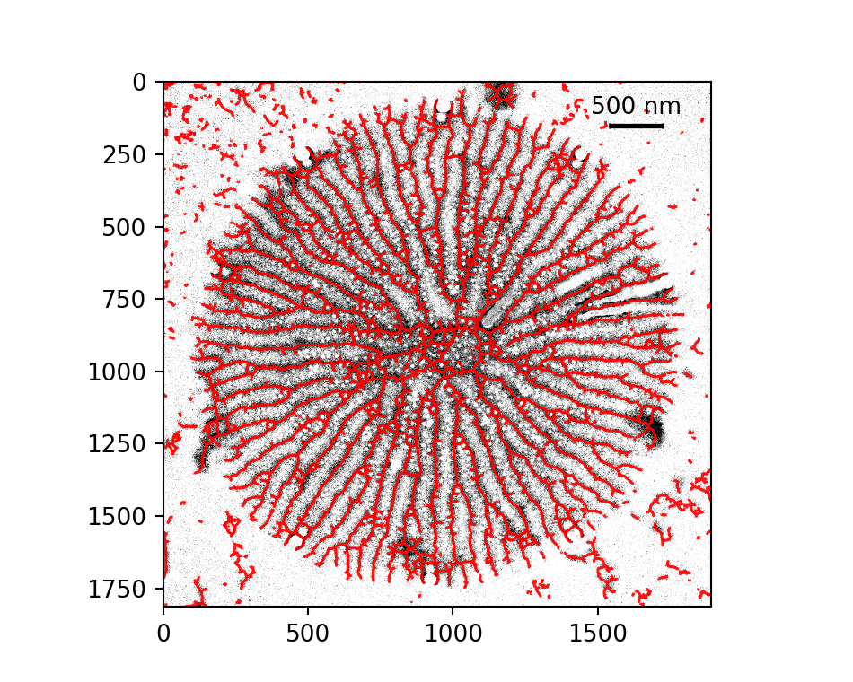
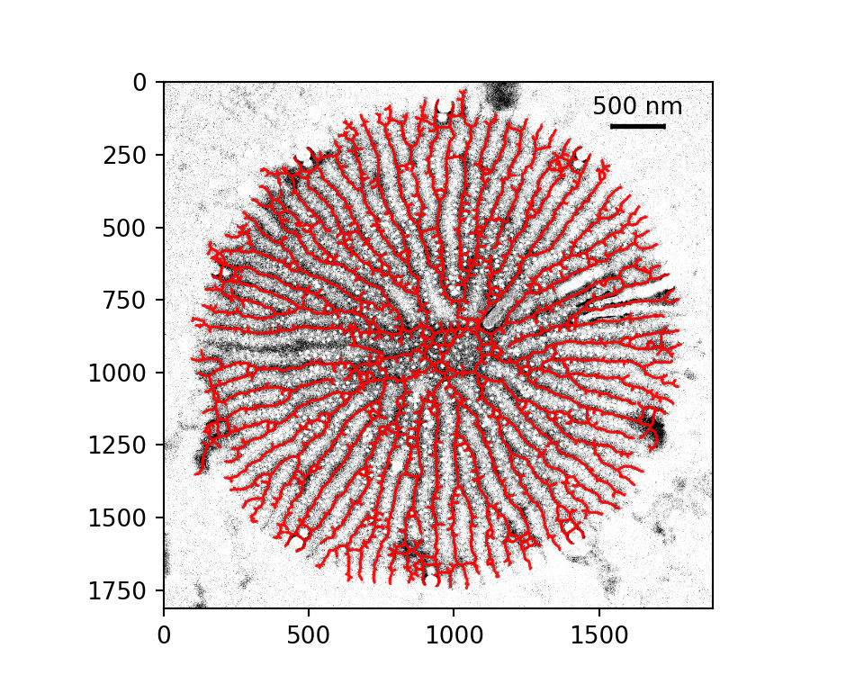
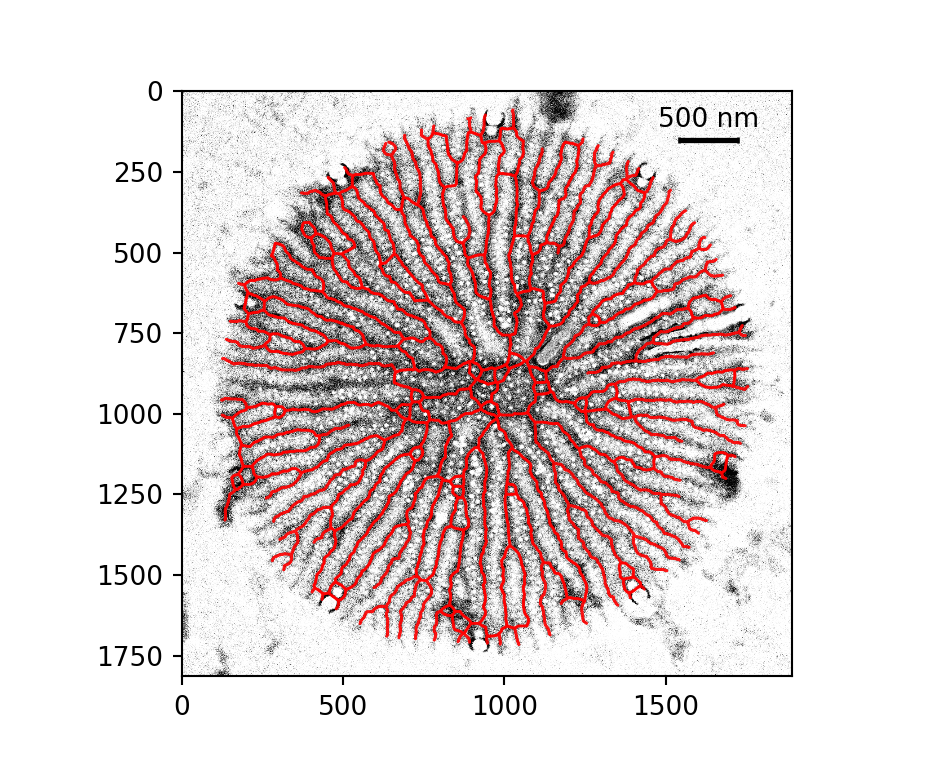

# Mechanism of branching morphogenesis inspired by diatom silica formation

This repository is my implementation of the work of **I. Babenko, N. Kröger, & B.M. Friedrich, 2024**.

## Introduction

### Paper Summary

### Reproducing What?

## Setup 
Note that the commands that follow are run on Arch Linux but they can similarly be ran on other OSes. I have added steps specific to my system's requirements or for errors I personally ran into.

### Requirements
Start with installing pyenv to maintain versions of python. Ignore if it already exists.
```
sudo pacman -S pyenv
```

Then in the ~/.bashrc file, add the following commands to initialize pyenv:
```
export PYENV_ROOT="$HOME/.pyenv"
export PATH="$PYENV_ROOT/bin:$PATH"
eval "$(pyenv init --path)"
eval "$(pyenv init -)"
```

Restart the terminal, and then in the project directory create a virtual environment with version specific to what is mentioned in the README.txt file of the dataset:

```
pyenv install 3.7.4
pyenv local 3.7.4
python -m venv env 
. env/bin/activate
```

To install requirements:
```
pip install -r requirements.txt
```
(I manually created the requirements.txt file with the primary packages as provided in the README.txt file and subsequently added the packages whose absence broke the scripts.)

For the jupyter notebooks to run the downloaded versions of the packages instead of the global version, the python kernel needs to be switched to the virtual environment created. To do that, run: 
```
python -m ipykernel install --user --name=env --display-name "Python (env)"
```
making sure *env* correctly represents the venv's name. After that switch the kernel in jupyter.

### Downloading the Dataset
Inside the project directory, run: 
```
wget https://zenodo.org/records/8095546/files/diatom-branching-morphogenesis-v1.0.zip
unzip diatom-branching-morphogenesis-v1.0.zip 
```
for automatic install. Or, manually download the zip file and move to the directory.

### Navigating the Dataset
(structured in order of files ran)

Folder Hierarchy:
```
diatom-branching-morphogenesis-v1.0
├── tem.image.analysis
│   ├── adaptive_thresholding.ipynb
│   ├── images
│   │   ├── img_001_optimized.jpg
│   │   ├── ...
│   │   └── img_038_optimized.jpg
│   ├── local_thresholding.py
│   ├── magnifications.txt
│   ├── pixel_pruning.py
│   └── __pycache__
│       ├── local_thresholding.cpython-37.pyc
│       └── pixel_pruning.cpython-37.pyc
├── t.pseudonana.model
│   ├── BranchDiatom.py
│   ├── get_valve_morphology.py
│   ├── __pycache__
│   │   ├── BranchDiatom.cpython-37.pyc
│   │   └── get_valve_morphology.cpython-37.pyc
│   ├── seed.png
│   └── simulations.ipynb
├── growing.SDV.domain
│   ├── BranchDiatom.py
│   ├── __pycache__
│   │   ├── BranchDiatom.cpython-37.pyc
│   │   └── laplacians.cpython-37.pyc
│   ├── seed_distorted.png
│   └── t.pseudonana.simulations.SDV.ipynb
├── aberrants
│   ├── laplacians.py
│   ├── seed_twos1.png
│   └── t.pseudonana.simulations.abberants.ipynb
├── a.sibiricum.model
│   ├── laplacians.py
│   ├── pennate_simulation.ipynb
│   └── __pycache__
│       └── laplacians.cpython-37.pyc
└── c.cryptica
    └── simulations.ipynb
```

## Reproducing the Results
All the outputs are saved in the results/ directory

1. `./tem.image.analysis/`

**Purpose**: corresponds to Figure S1. Analysis of TEM images.

**Changes made**: 
- `adaptive_thresholding.ipynb`: 
	- fixed path variable to match local directory structure.
	- added saved_skeletons directory to store the skeletons text files.
	- added ske_exp_obj variable with ske_exp to capture path_ske for image with object impurities.
- `pixel_pruning.py`: 
	- removed the import of pymorph library since it cannot be installed in Python >3.x and was not in use either.
- `local_thresholding.py`: 
  	- added path_ske in return for function skeletonize_TEM_GS

**Results**: 

<p align= "center">
  
  
</div>

<p align= "center">
  
</div>

<p align = "center">
  <b>Figure 1</b>: (Top left) Image 36 with noise. (Top right) Image 36 without noise. (Bottom) Image 36 with pruned short branches and removed small cycles.
</p>

## Notes on Reproducibility

## Conclusion
Reflection on:
- what i learned
- what worked
- what remains if anything

## Citation
**Paper**: I. Babenko, N. Kröger, & B.M. Friedrich, Mechanism of branching morphogenesis inspired by diatom silica formation, Proc. Natl. Acad. Sci. U.S.A. 121 (10) e2309518121, https://doi.org/10.1073/pnas.2309518121 (2024).

**Dataset**: Iaroslav Babenko. (2023). Mechanism of branching morphogenesis inspired by diatom silica formation. Zenodo. https://doi.org/10.5281/zenodo.8095546
