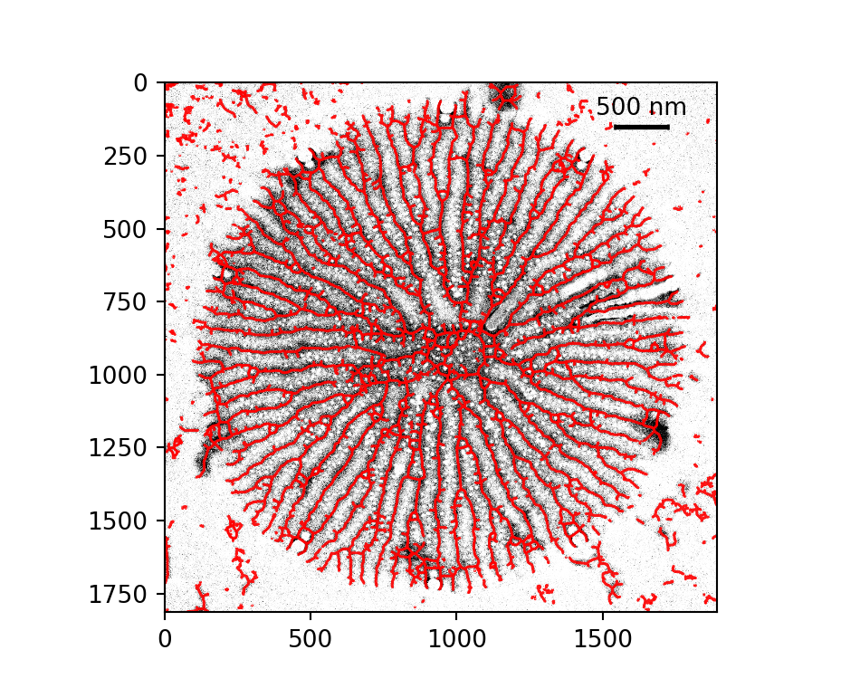
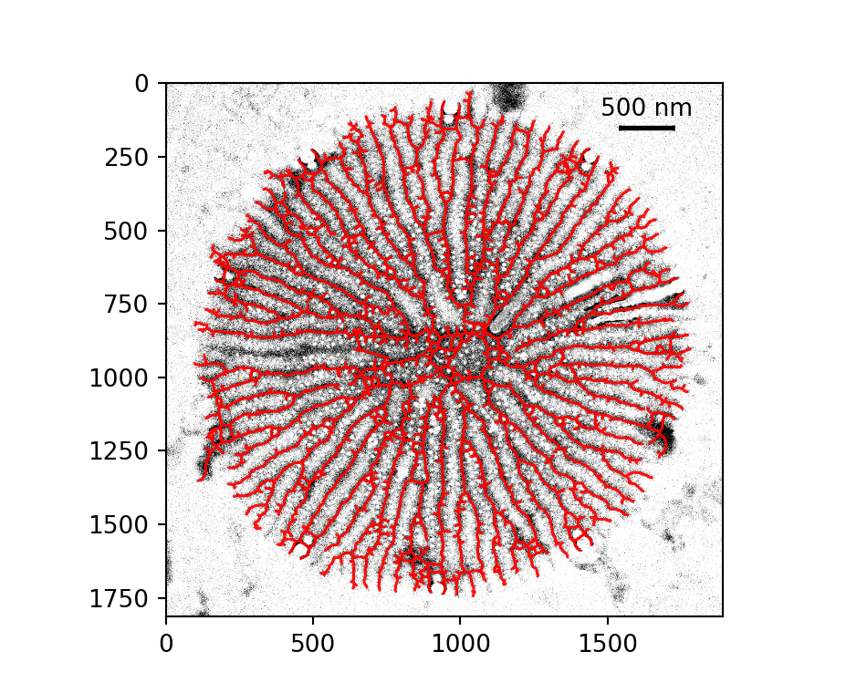
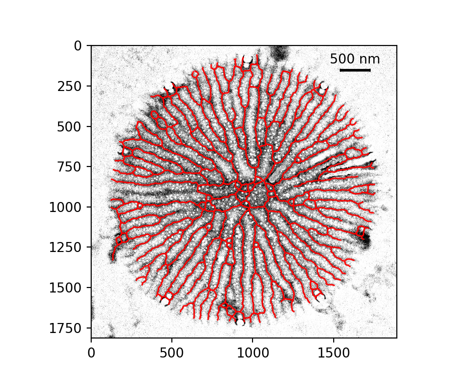

# Mechanism of branching morphogenesis inspired by diatom silica formation

This repository is my implementation of the work of **I. Babenko, N. Kröger, & B.M. Friedrich, 2024**.

## Introduction

### Paper Summary

### Reproducing What?

## Setup 
Note that the commands that follow are run on my Arch Linux system but they can similarly be ran on other OSes. I have included steps specific to my system's requirements or for errors I personally ran into.

### Requirements
Start with installing pyenv to maintain versions of python. Ignore if it already exists.
```
sudo pacman -S pyenv
```

Then in the ~/.bashrc file, add the following commands to initialize pyenv:
```
export PYENV_ROOT="$HOME/.pyenv"
export PATH="$PYENV_ROOT/bin:$PATH"
eval "$(pyenv init --path)"
eval "$(pyenv init -)"
```

Restart the terminal, and then in the project directory create a virtual environment with version specific to what is mentioned in the README.txt file of the dataset:

```
pyenv install 3.7.4
pyenv local 3.7.4
python -m venv env 
. env/bin/activate
```

To install requirements:
```
pip install -r requirements.txt
```
(I manually created the requirements.txt file with the primary packages as provided in the README.txt file and subsequently added the packages whose absence broke the scripts.)

For the jupyter notebooks to run the downloaded versions of the packages instead of the global version, the python kernel needs to be switched to the virtual environment created. To do that, run: 
```
python -m ipykernel install --user --name=env --display-name "Python (env)"
```
making sure *env* correctly represents the venv's name. After that switch the kernel in jupyter.

### Downloading the Dataset
Inside the project directory, run: 
```
wget https://zenodo.org/records/8095546/files/diatom-branching-morphogenesis-v1.0.zip
unzip diatom-branching-morphogenesis-v1.0.zip 
```
for automatic install. Or, manually download the zip file and move to the directory.

### Navigating the Dataset
(structured in order of files ran)

Folder Hierarchy:
```
diatom-branching-morphogenesis-v1.0
├── tem.image.analysis
│   ├── adaptive_thresholding.ipynb
│   ├── local_thresholding.py
│   ├── pixel_pruning.py
│   ├── magnifications.txt
│   ├── images
│   │   ├── img_001_optimized.jpg
│   │   ├── ...
│   │   └── img_038_optimized.jpg
│   └── __pycache__
│       ├── local_thresholding.cpython-37.pyc
│       └── pixel_pruning.cpython-37.pyc
├── t.pseudonana.model
│   ├── BranchDiatom.py
│   ├── get_valve_morphology.py
│   ├── __pycache__
│   │   ├── BranchDiatom.cpython-37.pyc
│   │   └── get_valve_morphology.cpython-37.pyc
│   ├── seed.png
│   └── simulations.ipynb
├── growing.SDV.domain
│   ├── BranchDiatom.py
│   ├── __pycache__
│   │   ├── BranchDiatom.cpython-37.pyc
│   │   └── laplacians.cpython-37.pyc
│   ├── seed_distorted.png
│   └── t.pseudonana.simulations.SDV.ipynb
├── aberrants
│   ├── laplacians.py
│   ├── seed_twos1.png
│   └── t.pseudonana.simulations.abberants.ipynb
├── a.sibiricum.model
│   ├── laplacians.py
│   ├── pennate_simulation.ipynb
│   └── __pycache__
│       └── laplacians.cpython-37.pyc
└── c.cryptica
    └── simulations.ipynb
```

## Reproducing the Results
All the reproduced results are saved in the results/ directory and the final codes in diatom-branching-morphogenesis-v1.0/ directory.

1. `./tem.image.analysis/`

**Purpose**: corresponds to Figure S1. Analysis of TEM images.

**Changes made**: 
- `adaptive_thresholding.ipynb`: 
	- fixed path variable to match local directory structure.
	- added saved_skeletons directory to store the skeletons text files.
	- added ske_exp_obj variable with ske_exp to capture path_ske for image with object impurities.
	- `import os` was called twice; removed the redundancy.
- `pixel_pruning.py`: 
	- removed the import of pymorph library since it cannot be installed in Python >3.x and was not in use either.
- `local_thresholding.py`: 
  	- added path_ske in return for function skeletonize_TEM_GS

**Results**: 

<p align= "center">
   &nbsp;&nbsp;&nbsp;
  
</div>

<p align= "center">
  
</div>

<p align = "center">
  <b>Figure 1</b>: Image 36. (Top Left) with noise; (Top right) without noise; (Bottom) with pruned short branches, removed small cycles.
</p>

2. `./t.pseudonana.model/`

**Purpose**: simulates the early stage development of a rib pattern for a digitally-drawn initial seed.

**Changes made**:
- `BranchDiatom.py`:
	- had to initially remove the `multichannel = False` from skimage.transform.rescale since it was no longer a recognized argument but later had to put it back because without it the loop over time step in the simulation failed to output desired images.
- `simulations.ipynb`: 
  	- 'square' in recent versions of scikit is deprecated and removed and has to be replaced with 'footprint_rectangle'; no changes made here for the version used though.
	- 'binary_dilation' in recent versions of scikit is deprecated and removed and has to be replaced with mirror_footprint'; no change made here for the version used though.
	- `from tqdm.notebook import tqdm` was replaced with `from tqdm import tqdm`
- `get_valve_morphology.py`:
	- `import circle` was replaced with `import circle_parameter`; though the file was not used in the simulation.
	- added the following code in the time step loop to save figures and observe the growth:

```
    plt.figure()
    ax = plt.gca()
    ax.imshow(S3, cmap='bone_r')
    plot_scale_bar(S3, mf, ax)
    plt.savefig(f"./sim_images_S3//S3_pattern{i:06d}.png",
                dpi=150, bbox_inches="tight")
    plt.close()

    
    plt.figure()
    ax = plt.gca()
    ax.imshow(skeleton_dilated, cmap='bone_r')
    plot_scale_bar(S3, mf, ax)
    plt.savefig(f"./sim_images_skel_dilated//S3_pattern{i:06d}.png",
                dpi=150, bbox_inches="tight")
    plt.close()
```

Ultimately, no significant change in the existing code was needed to be made after the environment was set up with the proper packages, installation of which required navigating the files and running the codes multiple times initially and encountering errors.

**Results**:
- For the given initial seed, and running the simulation for 5000 time steps gave the following result. 
  
<div align="center">
  <video width="600" controls>
  	<source type="video/mp4" src="./results/S3_output_video_120fps.mp4"> 
  </video>
</div>

<p align="center">
https://github.com/user-attachments/assets/5f6ded86-1d4c-4103-9f48-2b8af5ef6220
</p>

<p align = "center">
  <b>Figure 1</b>: Simulation of pattern formation.
</p>


- Running the same seed for 10000 time steps gave: 
  
- I also ran the simulation for different shapes of initial seeds keeping the thickness constant at 3 px:
	- Square with sharp corners
	- Square with smoother corners
	- Triangle with sharp corners
	- Triangle with smoother corners
	- Perfect circle
	- Ellipse
	- Freehand digitally drawn rough and distorted annulus
	- Freehand digitally drawn irregular shape


---> Changed the seed by drawing out a random closed shape.
---> Changed the values of the parameters to study the differences in the output.

3. `./growing.SDV.domain/`
	
**Purpose**:

**Changes made**:

**Results**:

## Notes on Reproducibility

## Conclusion
Reflection on:
- what i learned
- what worked
- what remains if anything

## Citation
**Paper**: I. Babenko, N. Kröger, & B.M. Friedrich, Mechanism of branching morphogenesis inspired by diatom silica formation, Proc. Natl. Acad. Sci. U.S.A. 121 (10) e2309518121, https://doi.org/10.1073/pnas.2309518121 (2024).

**Dataset**: Iaroslav Babenko. (2023). Mechanism of branching morphogenesis inspired by diatom silica formation. Zenodo. https://doi.org/10.5281/zenodo.8095546
